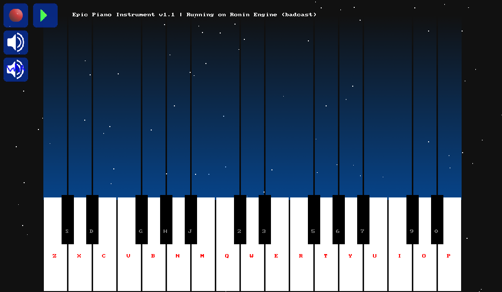

# epic-piano-instrument 🎹

    

Welcome to "Epic Piano" - a virtual instrument based on the RoninEngine framework that allows you to unleash your creative potential and craft music of epic proportions. This project combines the beauty of a classical piano with cutting-edge technology to provide you with a unique musical experience.

## About the Project

"Epic Piano Instrument" is an inspiring musical tool crafted using the RoninEngine framework. Drawing inspiration from epic sounds and harmonies, this project empowers you to create music that can transport listeners to fantastical worlds and captivating journeys.

## Features

- **Intuitive Interface**: Simple and user-friendly controls allow even beginners to start composing melodies right away.
- **Multiple Octaves**: An extended keyboard range lets you play across different octaves, creating deep and rich sounds.

## Requirements

- [RoninEngine](https://github.com/badcast/ronin-engine).
- Operating System: Windows 10 / macOS / Linux

## Installation and Setup

1. Clone the repository to your computer.
2. Open the project in the RoninEngine.
3. Load your sound samples and audio files.
4. Run the project and start crafting your epic music!

## Authors

- Full Name ([badcast](https://github.com/badcast))

## License

This project is licensed under see the [`LICENSE`](LICENSE) file for details.

## Contact Us

If you have any questions, suggestions, or simply want to share your creative ideas, feel free to badcast.

